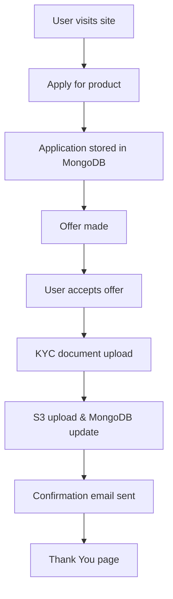

# L.D Banking App

>A full-stack banking application for modern banking products, with robust error monitoring, cloud integrations, and a seamless user experience.


## Tech Stack
- **Frontend:** React (Vite), Tailwind CSS
- **Backend:** Node.js, Express, MongoDB (Mongoose)
- **Cloud:** AWS S3 (KYC uploads), AWS EventBridge (event publishing)
- **Error Monitoring:** Honeybadger (backend & frontend)
- **Other Integrations:** Salesforce, KYC, Email notifications

---

## User Flow Chart



---

## Features
- Modern, responsive UI/UX (navbar, header, mobile layouts, gradient footer)
- Users apply for Loan, Flash Credit, or Credit Card
- Secure authentication and application management
- KYC document upload (image/PDF) to S3
- Offer acceptance and confirmation flows
- All major flows: login, apply, offer, KYC, completion
- Robust error handling and Honeybadger reporting (backend & frontend)
- Environment compatibility for local and production (Render)
- All API errors and timeouts reported to Honeybadger

---
---


## Project Structure
```
my-banking-backend/
├── controllers/
│   └── applicationController.js
├── models/
│   └── Application.js
├── routes/
│   └── applications.js
├── utils/
│   ├── awsEventBridge.js
│   ├── email.js
│   ├── kyc.js
│   └── salesforce.js
├── publishLoanEvent.js
├── index.js
├── .env
├── package.json
├── ...
└── my-banking-frontend/
    ├── src/
    │   ├── pages/Apply.jsx
    │   ├── pages/Offer.jsx
    │   ├── pages/KycPage.jsx
    │   ├── pages/Login.jsx
    │   ├── pages/Register.jsx
    │   ├── pages/Applications.jsx
    │   ├── api/applications.js
    │   └── ...
    ├── tailwind.config.cjs
    ├── postcss.config.cjs
    ├── .env
    └── ...
```

---


## Environment Variables

### Backend (`my-banking-backend/.env`)
```
MONGO_URI=your_mongodb_connection_string
PORT=5001
AWS_ACCESS_KEY_ID=your_aws_access_key
AWS_SECRET_ACCESS_KEY=your_aws_secret
AWS_REGION=your_aws_region
AWS_S3_BUCKET=your_s3_bucket_name
HONEYBADGER_API_KEY=your_honeybadger_api_key
NODE_ENV=production
BASE_URL=https://l-d-banking.onrender.com
```

### Frontend (`my-banking-frontend/.env`)
```
VITE_API_URL=https://l-d-banking.onrender.com/api
VITE_PROXY_API=http://localhost:5001
```

- On Render, set these variables in the "Environment" section for each service.
- For local development, use `VITE_API_URL=http://localhost:5001/api` in the frontend `.env`.

---


## Setup & Run

### Prerequisites
- Node.js & npm
- MongoDB Atlas or local MongoDB
- AWS account (EventBridge, S3)

### 1. Clone the repo
```bash
git clone https://github.com/luchezar-d/L.D-Banking.git
cd L.D-Banking/my-banking-backend
```

### 2. Install dependencies
```bash
npm install
cd my-banking-frontend
npm install
```

### 3. Configure environment variables
- See above for `.env` examples for backend and frontend.

### 4. Start the backend
```bash
npm start
```

### 5. Start the frontend (local dev)
```bash
cd my-banking-frontend
npm run dev
```

---


## API Endpoints
- `POST /api/apply` — Submit a new application
- `GET /api/applications` — List all applications
- `POST /api/offer/:id/accept` — Accept an offer (triggers KYC)
- `POST /api/offer/:id/upload` — Upload a KYC document (multipart/form-data, field: `kycDocument`)
- `GET /api/applications/:id` — Get application by ID

---


## AWS EventBridge
- Publishes a `LoanOfferMade` event for every new application.
- Event includes all application fields and is sent to the `LoanEventsBus`.

---


## Frontend Features
- Responsive, modern UI/UX with:
  - Fixed, full-width navbar (hamburger menu on mobile)
  - Header section fills viewport under navbar
  - Main content uses full width, with max-w constraints
  - Footer with gradient, social icons, contact info, and map
  - All pages are mobile-friendly and visually consistent
- Uses Tailwind CSS best practices and reusable styles
- API calls use environment-based URLs for cross-device compatibility

---


## Error Monitoring (Honeybadger)
- All backend and frontend errors are reported to Honeybadger with full request context
- Add your `HONEYBADGER_API_KEY` to backend `.env`

---


## Deployment (Render)
- Add all required environment variables in Render dashboard for both frontend and backend
- Frontend must use `VITE_API_URL=https://l-d-banking.onrender.com/api`
- Backend must use `BASE_URL=https://l-d-banking.onrender.com`
- Redeploy after updating environment variables

---


## Contributing
1. Fork the repo
2. Create a feature branch (`git checkout -b feature/your-feature`)
3. Commit your changes
4. Push to your branch
5. Open a Pull Request

---


## License
MIT
